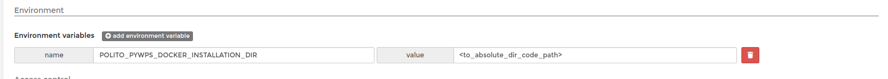

# POLITO PYWPS DOCKER

## Build main images
```
cd docker/pywps
docker build -t polito/pywps:grass .
```

### Env variables:
|VAR NAME|DESCRIPTION|DEFAULT VALUE|
|---|---|---|
|POLITO_PYWPS_DOCKER_SHARED_VOLUME|Set absolute path for persistent data(volume)||

## CONFIG RUN WPS SERVER

### CONFIG

#### PyWPS config file
Copy `pywps.cfg.example` to `pywps.cfg` in *config/pywps/cfg* and set config params inside it.

#### Processes and wsgi bootstrap module

Inside *config/pywps/processes* put you PyWPS process script, i.e. `my_process.py`.

Copy `pywps.wsgi.example` to `pywps.wsgi` and set inside it your processes constructor, i.e.:

```python
from pywps.app.Service import Service

# processes need to be installed in PYTHON_PATH
from processes.my_process import MyProcess

processes = [
    MyProcess()
]

application = Service(processes)

```

#### Run WPS server

```
docker-compose up -d
``` 

to stop:
 
```
docker-compose down
```

If you have to change/add or delete processes, first execute `docker-compose down`, make your changed adn `docker-compose up -d` again.


### PORTAINER
To deploy into Portainer (https://www.portainer.io/) you have to use *docker-compose-portainer.yml* and set a nex env var into portainer section:

**POLITO_PYWPS_DOCKER_INSTALLATION_DIR**, absolute path to this docker code.





 